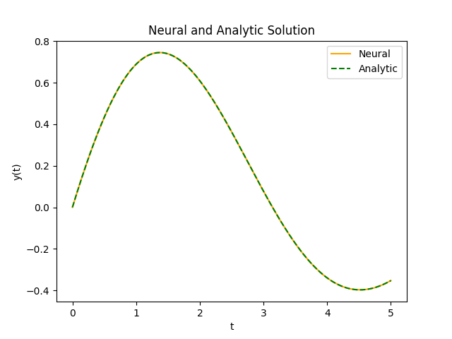

# PyTorch Implementation to solve Differential Equations using Neural networks.

The repository contains the code and results for the PyTorch Implementation of the paper titled <a href="https://www.cs.uoi.gr/~lagaris/papers/TNN-LLF.pdf">Artificial Neural Networks for Solving Ordinary and Partial Differential Equations.</a> Further, Euler Method, a popular numerical method for solving differential equations has been implemented as well.

## Implemented
- [x] First Order ODE
- [x] Second Order ODE
- [x] PDE with Dirichlet Boundary Conditions
- [ ] PDE with Mixed Boundary Conditions

# Results
## First Order ODE
### Equation Considered and Conditions
- Equation: $\frac{dy}{dx}+y=\exp(\frac{-x}{5})\cos(x)$
- Initial Condition: $y(0)=0$
- Neural Trial Solution: $y=A+xN(x,\theta)$, $N(x,\theta)$ is the Neural Function with parameter $\theta$

### Graph of Neural and Analytic Solution

    

## Second Order ODE
### Equation Considered and Conditions
- Equation: $\frac{d^2y}{dx^2}+\frac{1}{5}\frac{dy}{dx}+y=\exp(\frac{-x}{5})\cos(x)$
- Initial Conditions: $y(0)=0,y'(0)=1$
- Neural Trial Solution: $y=A+A_1x+x^2N(x,\theta)$

### Graph of Neural and Analytic Solution

    

## Partial Differential Equations
### Equation Considered and Dirichlet Boundary Conditions
- Equation: $\nabla^2\psi(x,y)=\exp(-x)(x-2+y^3+6y)$
- Boundary Conditions:$\psi(0,y)=y^3,\psi(1,y)=exp(-1)(1+y^3),\psi(x,0)=x\exp(-x),\psi(x,1)=\exp(-x)(x+1)$
- Neural Trial Solution: $\psi=A(x,y)+x(1-x)y(1-y)N(x,y,\theta)$
  
### Graph of Neural and Analytic Solution

    

